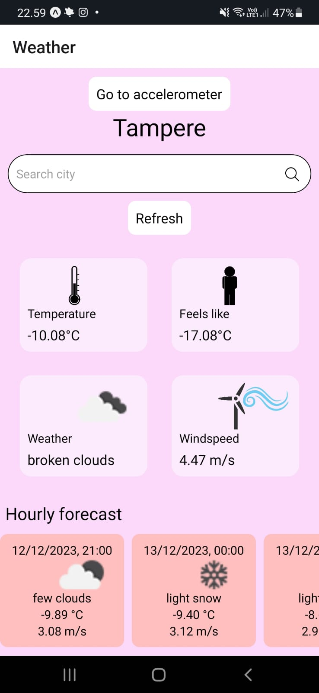
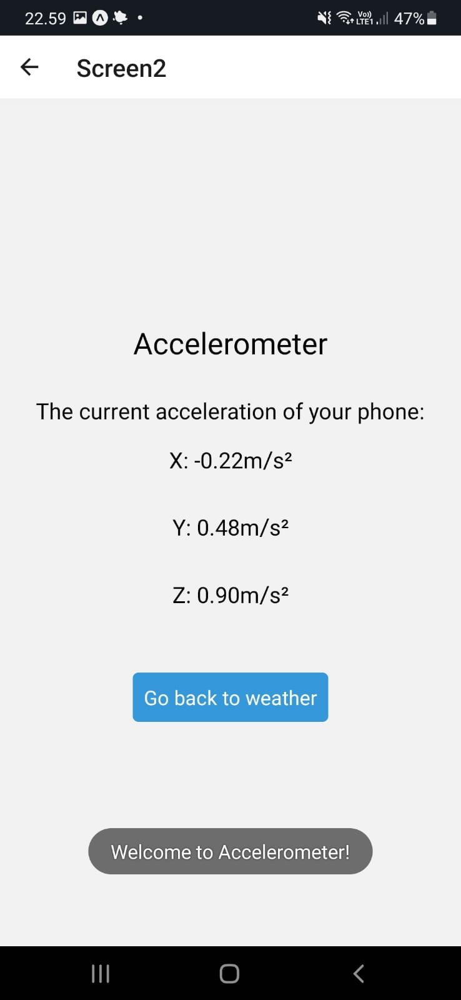

# Weather-and-Accelerometer
#### Final project for course Mobile application development
The initial view of my application is identical to the weather application I have been constructing during the weekly exercises. It retrieves data from https://openweathermap.org/ and presents information such as temperature, wind speed, general weather conditions, and the perceived temperature. The current day's weather is displayed, and at the bottom of the screen, there is a scrollable list showing the weather forecast for the upcoming hours and days. 

The default location for the weather app is Tampere, but users have the flexibility to search for weather information in different locations. Additionally, users can manually refresh the information as needed. 

 

Users can access a second screen that exhibits their phone's acceleration on the x, y, and z axes. Upon accessing this second screen, an Android Toast message is displayed briefly. The second screen also features a button that users can utilize to return to the first screen. 

 

